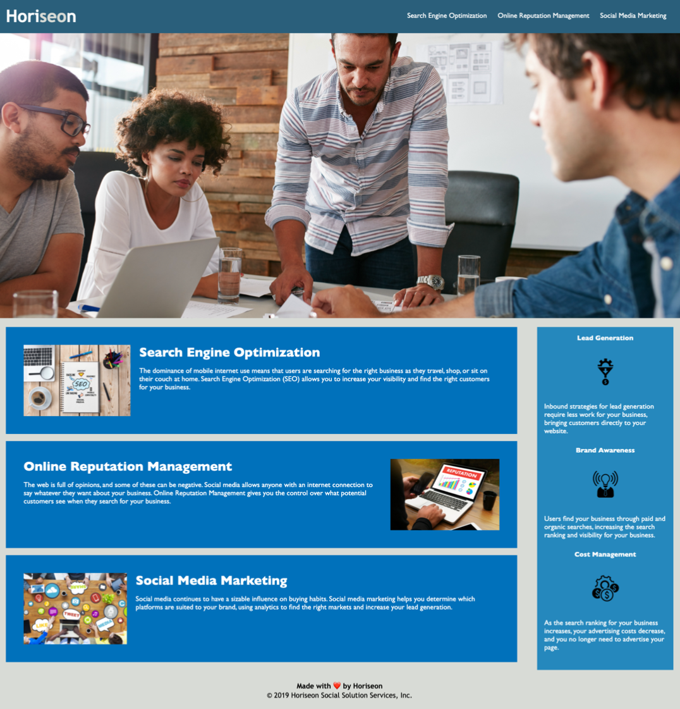

# week1-refactor-homework

## Description
Horiseon Social Solution Services, Inc. is a marketing agency that provides search engine optimization, online reputation management, and social media marketing. The company needed to update its codebase to adhere to accessibility standards in order to remain optimized for search engines and secure long-term sustainability, as well as to provide as much equitable reach to global audiences as possible. 

To improve and optimize accessibility, alt tags were added to all images and comments included in the grouping of CSS selector properties. These additions provide other readability options for users encountering visual access issues with the application. Links were also activated for easier navigation within the application.

During this update, I learned that there are many options available to increase accessibility and that providing details in conjunction with streamlining the codebase ultimately increase the sustainability and ease of an application. 

## Installation
For installation and deployment, please [click here](https://candiceywu.github.io/week1-refactor-homework/). The application should launch and all links within it are active.

## Usage
The application includes navigation links that provide ease of use for redirecting to other sections below. The following image shows the web application's appearance:

.

---

